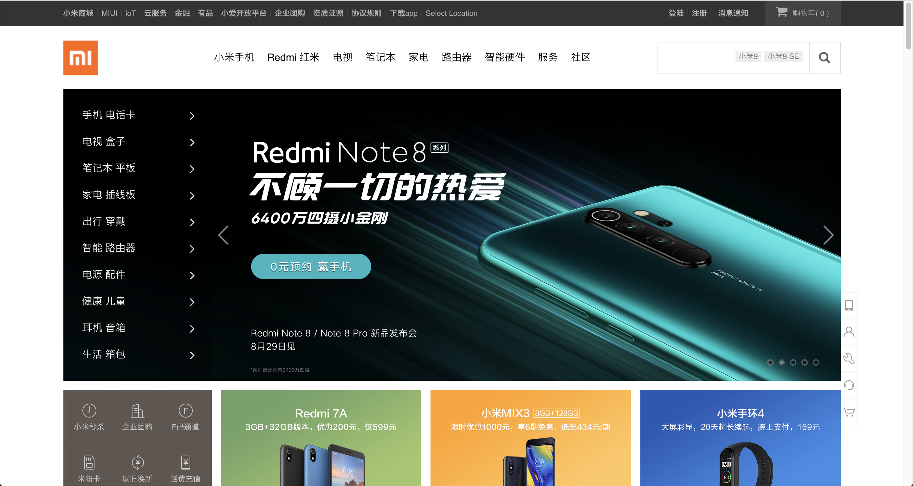

# 小米商城首页-使用Vue仿写

> ### 简介

* 基于Vue的小米商城首页仿写，这是我学习Vue路上的一个大型项目(<del>DEMO</del>)，原版代码发布于``MyProject-Contents``仓库，现在迁移到这里。

* 项目没有用到API，图片等静态资源都是直接引用官网的，如果图片原地址更改，那么部分图片可能存在**无法加载**的情况。所有的动画效果都是纯手写的。

* 项目预览地址：[请点这里](https://starlightunion.github.io/Xiaomi-Vue/dist/index.html#/)

> ### 学习到的内容

* 1.Vue的一次深入了解，对整个框架有了完整的印象；学习了Vue的**组件化思想**，项目组件化复用；熟悉了项目开发时的配置和结构等。

* 2.Vue的**通信**方式。
> * ``props``父->子组件通信
> 
> ```
> // 父组件
> <div @click='clickEvt'></div>
> <Child :a='a' rel='children'></Child>
> 
> import 'Child' from '../components/Child'
> export default {
> 	name: 'father',
> 	data () {
> 		a: [1, 2, 3]
> 	},
> 	methods: {
> 		clickEvt: function () {
> 			this.$refs.children.stop();// 父组件调用子组件方法
> 		}
> 	},
> 	components: {
> 		'Child': Child
> 	}
> }
> 
> // 子组件
> ...
> 
> export default {
> 	name: 'child',
> 	data () {},
> 	methods: {
> 		stop: function () {console.log('stop');}
> 	},
> 	props: [a]
> }
> ```
> 
> * ``$emit``子->父组件通信
> 
> ```
> // 父组件
> <div @listen='listenEvt'></div>
> 
> import 'Child' from '../components/Child'
> export default {
> 	name: 'father',
> 	data () {
> 		a: [1, 2, 3]
> 	},
> 	methods: {
> 		listenEvt: function (mess) {
> 			console.log(mess);
> 		}
> 	}
> 	components: {
> 		'Child': Child
> 	}
> }
> 
> // 子组件
> <div @click='clickEvt'></div>
> 
> export default {
> 	name: 'child',
> 	data () {},
> 	methods: {
> 		clickEvt: function () {
> 			this.$emit('listen', 'this is a message from child');
> 		}
> 	}
> }
> ```
> 
> * 中央事件总线通信
> 
> ```
> // main.js
> new Vue({
>  router,
>  render: h => h(App),
>  data: {
>    bus: new Vue(),// 暴露
>    ...
>  }
>}).$mount('#app')
>
> // 发送方
> bus.$emit('transInfo', [1, 2, 3]);// 需定义好名称
> 
> // 接收方
> bus.$on('transInfo', (data) => {
> 	console.log(datas)
> })
> ```

* 3.``<transition>``和``<transition-group>``的使用以及动画的设计。

* 4.Vue操作DOM。

* 5.钩子函数的使用。

* 6.等...

> ### 安装与使用

```
> npm install	#安装依赖
> npm run serve	#开发环境编译
> npm run build	#生产环境编译
```


